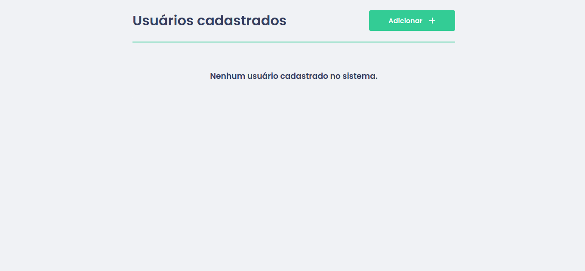
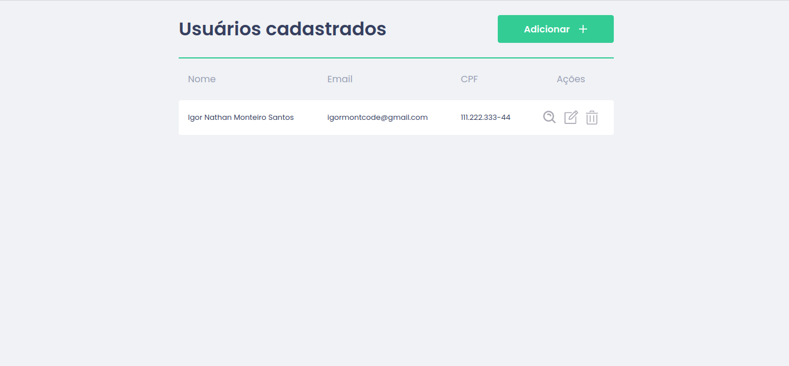
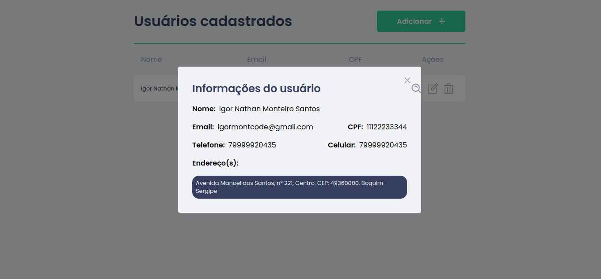
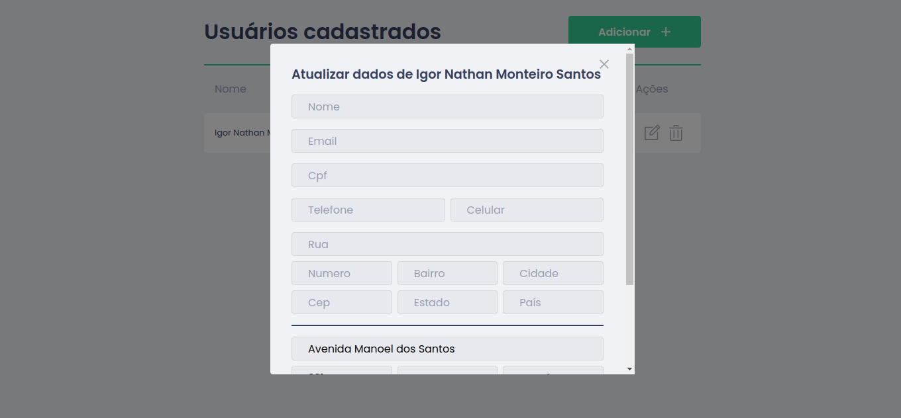
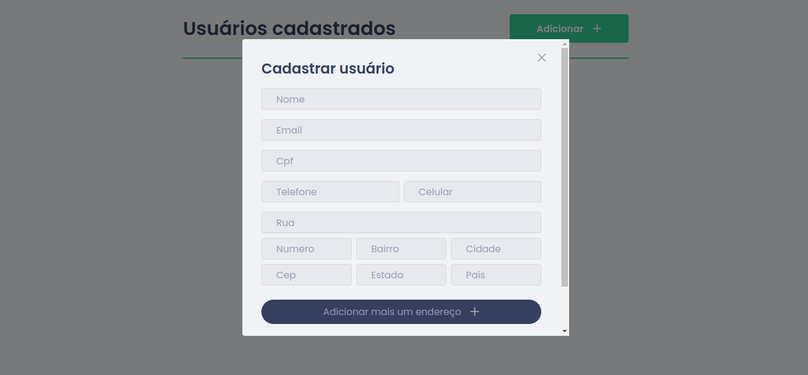
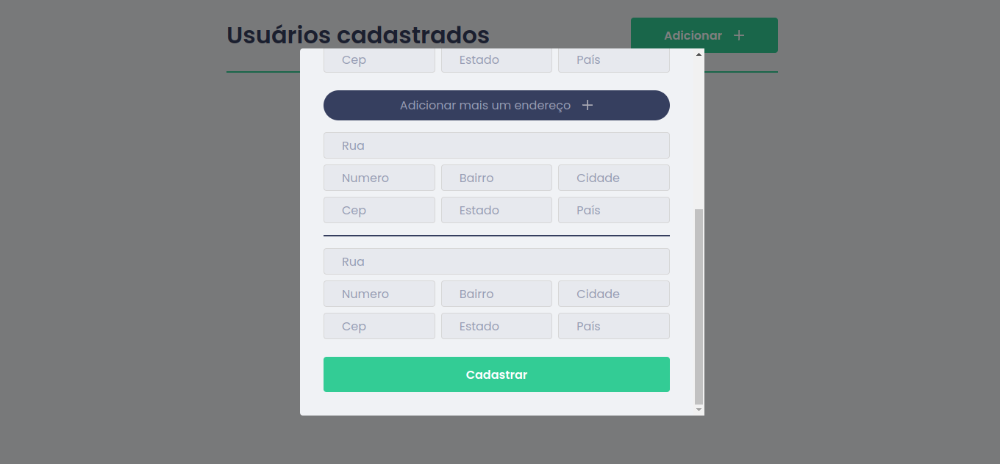

  <h1>Processo seletivo - Sergipetec</h1>

<h3 align="center">CRUD utilizando Angular 2+ 🚀</h3>

Utilizando dos recursos nativos do framework desenvolvi o desafio.

<h2> 🛠 Tecnologias </h2>

Essas foram as ferramentas usadas na implementação desse projeto:

- [Angular](https://angular.io/)
- [SCSS](https://sass-lang.com/)
- [JSON-Server](https://www.npmjs.com/package/json-server)
- [Cypress](https://docs.cypress.io/)

<h2> 🛠 Features </h2>

Alguns recursos do projeto:

- Atualizar novo usuário
- Criar novo usuário
- Listar usuário(s)
- Deletar usuário
- Poder adicionar mais de um endereço na criação do usuário
- Verificação se não há usuários cadastrados 
- Teste e2e da tela principal
- Validação de formulários

<h2>Visão geral do projeto</h2>

  
  

  
  

  
  

